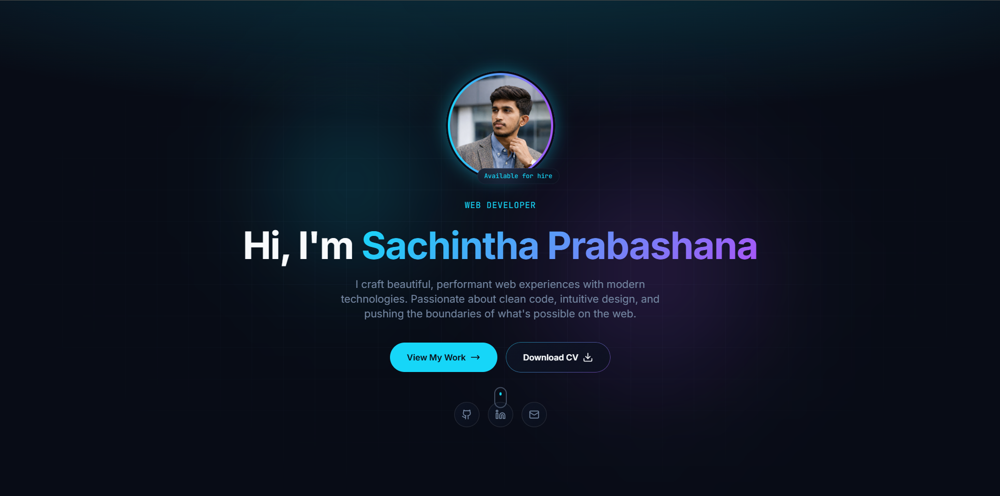

# Sachintha Prabashana - Hero Showcase Portfolio



<div align="center">

[](https://reactjs.org/)
[](https://www.typescriptlang.org/)
[](https://vitejs.dev/)
[](https://tailwindcss.com/)
[](https://ui.shadcn.com/)
[](https://www.framer.com/motion/)
[](LICENSE)

</div>

## 🚀 Overview

**Hero Showcase** is a premium, modern developer portfolio template built with **React**, **TypeScript**, and **Tailwind CSS**. Designed to be sleek, responsive, and highly interactive, it leverages the power of **Framer Motion** for smooth animations and **Shadcn/UI** for accessible, customizable components.

Whether you're showcasing your latest projects, highlighting your technical skills, or displaying your certifications, this portfolio provides a professional platform to present your work to the world.

## ✨ Key Features

-   **🎨 Modern UI/UX**: Clean, minimalist design with a focus on typography and whitespace.
-   **Aa Typography**: Beautifully integrated fonts and text hierarchies.
-   **🌙 Dark Mode Support**: Built-in theme switching capability using `next-themes`.
-   **📱 Fully Responsive**: Optimized for all devices, from mobile phones to large desktop screens.
-   **⚡ High Performance**: Powered by **Vite** for lightning-fast development and build speeds.
-   **ux Interactive Elements**:
    -   Smooth scroll animations with **Framer Motion**.
    -   Floating navigation bar for easy access.
    -   Interactive project cards and skill badges.
-   **🧩 Modular Architecture**:
    -   Component-based structure for easy maintenance.
    -   Data-driven content (update `src/data` to change content).
-   **🛠️ Tech Stack**:
    -   **Routing**: `react-router-dom` for seamless page transitions.
    -   **Forms**: `react-hook-form` + `zod` for robust form validation.
    -   **Charts**: `recharts` for visualizing data.
    -   **Carousel**: `embla-carousel-react` for sliding content.

## 🛠️ Built With

-   [React](https://reactjs.org/) - A JavaScript library for building user interfaces.
-   [TypeScript](https://www.typescriptlang.org/) - Typed JavaScript at any scale.
-   [Vite](https://vitejs.dev/) - Next Generation Frontend Tooling.
-   [Tailwind CSS](https://tailwindcss.com/) - A utility-first CSS framework.
-   [Shadcn/UI](https://ui.shadcn.com/) - Re-usable components built using Radix UI and Tailwind CSS.
-   [Framer Motion](https://www.framer.com/motion/) - A production-ready motion library for React.
-   [React Query](https://tanstack.com/query/v3/) - Powerful asynchronous state management.
-   [Lucide React](https://lucide.dev/) - Beautiful & consistent icons.

## 📂 Project Structure

```bash
hero-showcase/
├── public/              # Static assets (favicons, robots.txt)
├── src/
│   ├── assets/          # Images, icons, and other static files
│   ├── components/      # Reusable UI components
│   │   ├── ui/          # Shadcn/UI primitive components
│   │   └── ...          # Section components (Hero, About, Projects, etc.)
│   ├── data/            # Static data files (projects, skills config)
│   ├── hooks/           # Custom React hooks
│   ├── lib/             # Utility functions
│   ├── pages/           # Page components (Index, NotFound, etc.)
│   ├── App.tsx          # Main Application component
│   └── main.tsx         # Entry point
├── .eslintrc.json       # ESLint configuration
├── tailwind.config.ts   # Tailwind CSS configuration
├── tsconfig.json        # TypeScript configuration
└── vite.config.ts       # Vite configuration
```

## 🚀 Getting Started

Follow these instructions to get a copy of the project up and running on your local machine.

### Prerequisites

Ensure you have the following installed:

-   [Node.js](https://nodejs.org/) (v16 or higher)
-   [npm](https://www.npmjs.com/), [pnpm](https://pnpm.io/), or [bun](https://bun.sh/)

### Installation

1.  **Clone the repository**

    ```bash
    git clone https://github.com/Sachintha-Prabashana/modern-dev-portfolio.git
    cd hero-showcase
    ```

2.  **Install dependencies**

    ```bash
    npm install
    # or
    pnpm install
    # or
    bun install
    ```

3.  **Start the development server**

    ```bash
    npm run dev
    # or
    pnpm dev
    # or
    bun dev
    ```

4.  **Open your browser**

    Navigate to `http://localhost:5173` (or the port shown in your terminal).

## 📝 Customization

1.  **Update Content**:
    -   Navigate to `src/data/projectsData.ts` to update your project portfolio.
    -   Modify `src/data/techIcons.ts` (if it exists) or components directly to update skills.

2.  **Update Images**:
    -   Place your images in `src/assets/images/`.
    -   Update references in the data files.

3.  **Theming**:
    -   Customize colors and fonts in `tailwind.config.ts` and `src/index.css`.

## 🤝 Contributing

Contributions are what make the open-source community such an amazing place to learn, inspire, and create. Any contributions you make are **greatly appreciated**.

1.  Fork the Project
2.  Create your Feature Branch (`git checkout -b feature/AmazingFeature`)
3.  Commit your Changes (`git commit -m 'Add some AmazingFeature'`)
4.  Push to the Branch (`git push origin feature/AmazingFeature`)
5.  Open a Pull Request

## 📄 License

Distributed under the MIT License. See `LICENSE` for more information.

## 📧 Contact

Sachintha Prabashana - [LinkedIn Profile](https://www.linkedin.com/in/sachintha-prabashana-499209346/) - email@example.com

Project Link: [https://github.com/Sachintha-Prabashana/modern-dev-portfolio.git](https://github.com/Sachintha-Prabashana/modern-dev-portfolio.git)

